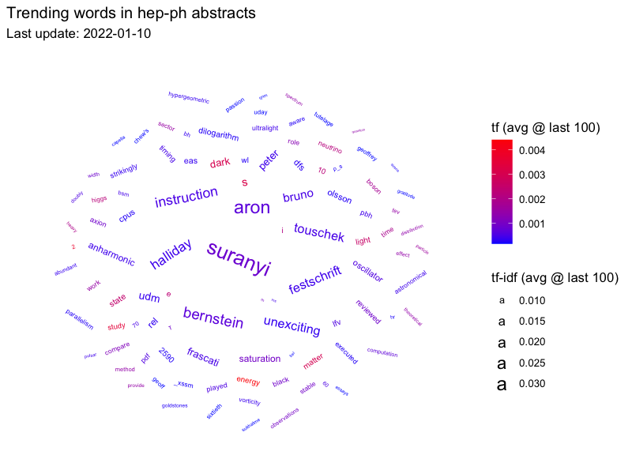

<!-- README.md is generated from README.Rmd. Please edit that file -->

# hepscrape

<!-- badges: start -->
<!-- badges: end -->

This repository automatically scrapes [arXiv](https://arxiv.org/) on a
daily basis, for new articles in the hep-ph category (also crossposted).

The resulting dataset is stored in R serialized data format (.rds) in
`data/hep_arxiv.rds`, and is a dataframe with the following fields:

    - id: arXiv unique identifier
    - submitted: date of submission
    - authors
    - title
    - abstract

More info coming soon.

